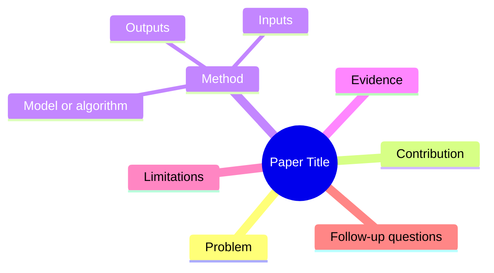

# Paper Reading Recipes

## Structured Paper Note

Use this shape unless the user asks for another format:

```markdown
# Title

## One-line Takeaway
## Problem
## Core Contribution
## Method
## Evidence
## Limitations
## Key Terms
## Questions To Check
## Reusable Ideas
```

## Deep Reading Checklist

- What exact problem is being solved?
- What is new compared with prior work?
- What assumptions does the method require?
- What data, benchmark, or proof supports the claim?
- Which ablations or counterexamples would weaken it?
- What would fail in real deployment?

## Literature Review Table

Use columns:

```text
Paper | Problem | Method | Data/Setting | Key Claim | Evidence | Limitation | Useful For
```

## Mermaid Concept Map


